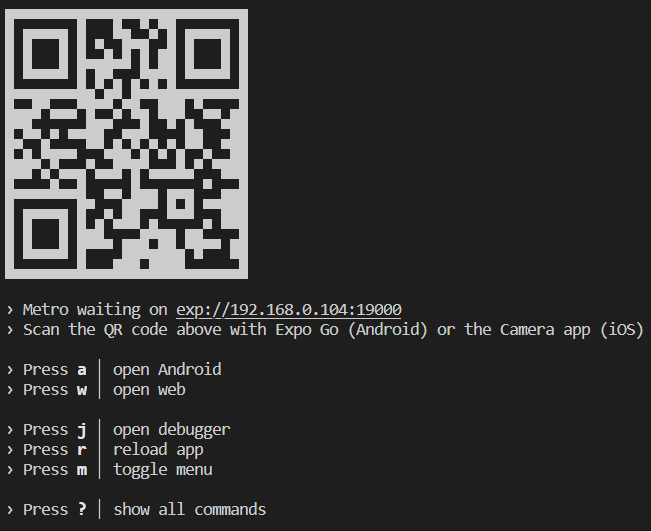
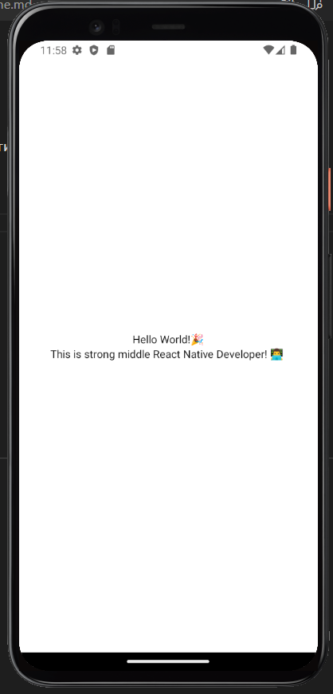

# goit-react-native-homework

Запуск проєкту!

1. Тицяйте в консоль npm start
2. Проєкт запуститься на [http://localhost:19000](http://localhost:19000) і в консолі запропонує вибрати один з варіантів запуску:
   
3. Якщо використовуєте Android Studio - тицяйте a в консоль і піде процес запуску на емуляторі гугла.
4. Якщо використовуєте Apple емулятор - тицяйте i в консоль і піде процес запуску на емуляторі яблук.
5. Також можна встановити застосунок Expo Go на ваш iPhone або Android телефон і сканувати qr-code який ви бачите в консолі.
   Тоді ваш додаток буде працювати на вашому улюбленому гаджеті!
6. Вуаля ваш додаток запсутився на пристрої:

   
